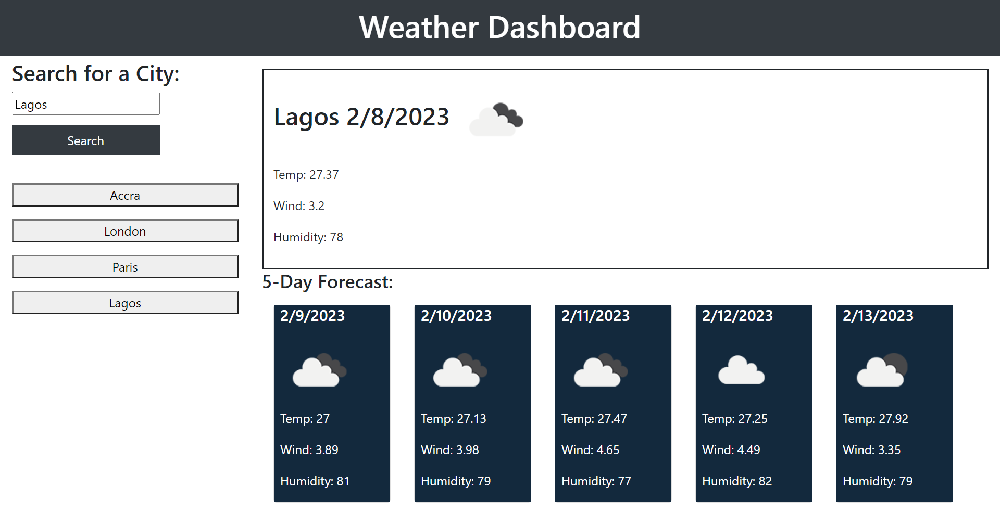

# my-weather-dashboard

## Description
My weather dashboard is a web based app that allows user to access current weather conditions for multiple cities including a five day forecast, built with HTML, CSS, JS (including moment.js web APIs and two waether server APIs). 

## App screen shot

## Usage Instruction/Features
Follow the [App URL](https://eugieno.github.io/my-weather-dashboard/), and you will land on the front page of the app pictured above. To search for the weather information for a city, type the name of the city into the text field and click the search button. On click, the app renders the current weather outlook in the box above and five day forecast below as seen in the picture below. 

The app provides a search history beneath the input form on the left hand side of the screen, that allows previously searched information to be re-rendered if desired. 

## Reflection 
This project was completed at the end of my 8th week at the University of Birmingham bootcamp in FE web dev. 

The main goal was to apply the knowledge and skills gained working with server APIs in week 8 and integrate this knowledge with others learned in previous weeks to build a dynamic web app. 

I did struggle initially integrating moment.js objects into the code logic for rendering the weather information after a successful API response call, which meant that I have to spend some time researching the moment.js documentation. In the proccess I learned amongst other things, the difference between JS object time and moment time. 

At the end, teh technology implemented in this project, include HTML, CSS, JS, Jquery library, moment.js and open-weather server API. 

## Upcoming (New) Features
In the immediate future, I plan to include the following features to extend the functonality and UI/UX of this web App.

1. More elegant UI
2. Voice over - for reading out the weather information. This feature will be specifically useful to people with accessibility concerns. 